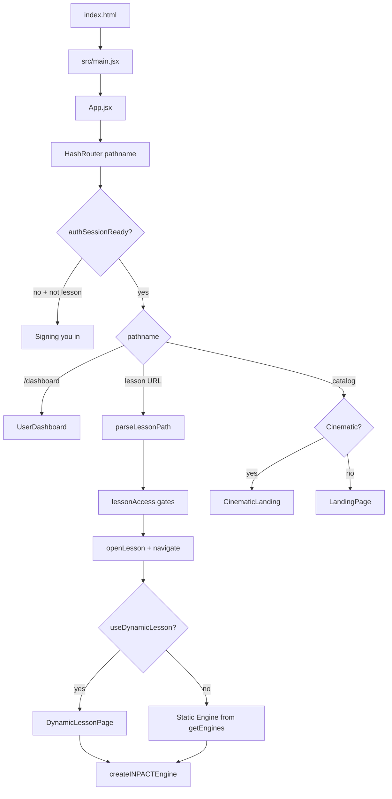

# INPACT platform — app & lesson load flow (temporary doc)

> **Temporary:** local reference only. Do not rely on this file being committed.

## 1. First load (`inpact.live` or any static host)

1. Browser receives **`index.html`** (SPA shell).
2. Script entry loads the Vite-built bundle (dev: `/src/main.jsx`; prod: hashed assets).
3. **`src/main.jsx`** mounts React on `#root`, wraps **`HashRouter`** → **`App`**.

**Routing note:** The app uses **`HashRouter`**, so React Router’s `location.pathname` is the path **after** `#`, e.g. `https://example.com/#/` or `https://example.com/#/lessons/react-ts/0`.

## 2. Bootstrap chain

| Step | File / module |
|------|----------------|
| HTML shell | `index.html` |
| Entry | `src/main.jsx` |
| Global styles | `src/index.css`, `highlight.js/styles/github.css` |
| Root component | `src/App.jsx` |

There is **no** per-URL server file after the first HTML; all in-app routes are client-side.

## 3. `App.jsx` as shell (not `<Routes>`)

`App` branches on `useLocation().pathname`, auth readiness, and lesson state:

| State / URL | UI |
|-------------|-----|
| `!authSessionReady` and not a lesson URL | “Signing you in…” |
| `/dashboard` | `UserDashboard` |
| `lessonIndex === null` + cinematic | `CinematicLanding` |
| `lessonIndex === null` (catalog) | Top bar + `LandingPage` |
| `lessonIndex !== null` | Lesson: `DynamicLessonPage` **or** static `Engine` |

**Public catalog track:** `LEARNER_FOCUS_TRACK` in `src/auth/learnerFocus.js` is **`react-ts`**. Deep links to other tracks are sent home.

## 4. Lesson URL contract

Defined in `src/auth/redirectPath.js`:

- `/lessons/<track>/<zeroBasedIndex>` — e.g. `/lessons/react-ts/3`
- Shorthand `/lessons/<n>` → **react-ts**, index `n`

`buildLessonPath` / `parseLessonPath` keep URLs and deep links consistent.

## 5. Opening a lesson

1. From **`LandingPage`**: `handleSelectLesson` / `handleStartFree` → gates in `src/auth/lessonAccess.js`.
2. **`openLesson`** sets `lessonTrack`, `lessonIndex`, `selectedLessonItem`, records access, **`navigate(buildLessonPath(...))`**.
3. **`useEffect`** on `location.pathname` (when `authSessionReady`) applies the same gates for **direct** hash links.

## 6. Choosing static engine vs dynamic (AI) lesson

After `lessonIndex` is set:

- `lessonList` from `getLessonList(effectiveTrack)` or `LESSON_LIST` fallback.
- `engines = getEngines(effectiveTrack, lessonList?.length)`.
- `Engine = engines[lessonIndex]`.
- `useDynamicLesson` when:
  - `effectiveTrack === 'mobile-angular'`, or
  - track in algo AI list, or
  - `AI_LESSONS_CONFIG.useAILessons && !useAILessonFailed`, or
  - no static engine for that index (`!hasStaticEngine`).

**React · TS static path:** `getEngines('react-ts')` → **`ENGINES_TS`** — components from `src/engines/react-ts/inpact_ts*_engine.jsx`.

**Dynamic path:** `src/ai-lessons/DynamicLessonPage.jsx` → orchestrator → `createINPACTEngine` with generated config. Env: `src/ai-lessons/config.js`.

## 7. Static lesson file shape (React-TS)

Each `inpact_tsNN_engine.jsx`:

1. `NODES` (reveal, objectives, question steps, …).
2. `sideItems` aligned to node ids.
3. `export default createINPACTEngine({ ... })` from `src/engines/inpact_engine_shared.jsx`.

`App` wraps the engine in **`LessonValidationContext.Provider`** and passes `onBackToLessons`, `onNextLesson`, `onLessonComplete`.

## 8. Flow diagram (Mermaid)

## 9. Related files (quick index)

- `src/main.jsx` — HashRouter + mount  
- `src/App.jsx` — state, gates, engine selection  
- `src/auth/redirectPath.js` — lesson URLs  
- `src/auth/learnerFocus.js` — `LEARNER_FOCUS_TRACK`  
- `src/auth/lessonAccess.js` — gates  
- `src/LandingPage` — catalog (import in App)  
- `src/engines/inpact_engine_shared.jsx` — shared lesson UI factory  
- `src/engines/react-ts/inpact_ts*_engine.jsx` — React-TS lesson content  
- `src/ai-lessons/DynamicLessonPage.jsx` — AI lesson pipeline  
- `vite.config.js` — dev proxy `/api` → AI server  

---

*Delete this file when no longer needed; it is intentionally uncommitted scratch.*
